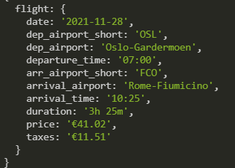

## Info

The code scraps the data from Norwegian Airlines from 2021-11-01 to 2021-11-30
from OSL (Oslo) to FCO (Rome-Flumicino) , for OneWay direct flights




## Dependencies

- puppeteer
- puppeteer-extra
- puppeteer-extra-plugin-stealth
- nodemon

### Installation

1. Clone the repo
   ```sh
   git clone https://github.com/dstonkus/flysas-scraper.git
   ```
2. Install NPM packages
   ```sh
   npm install
   ```
3. Start
   ```sh
   npm start
   ```
